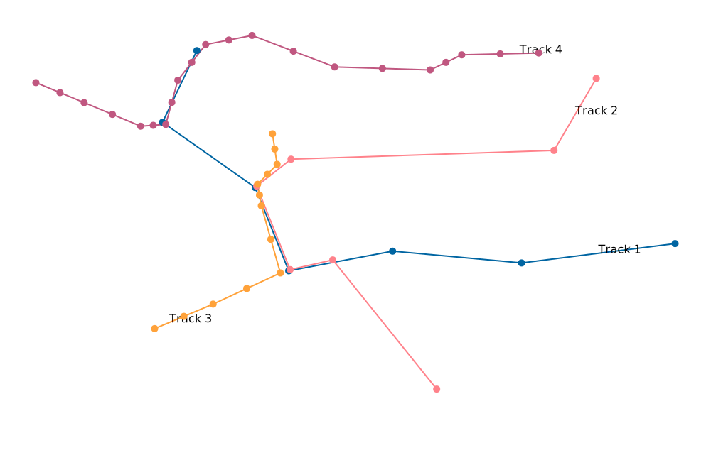
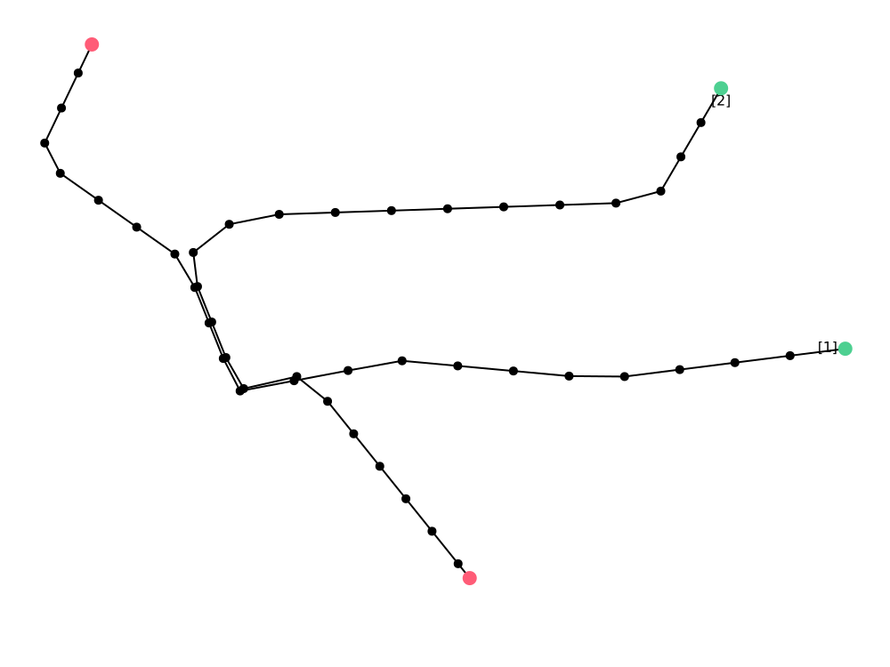
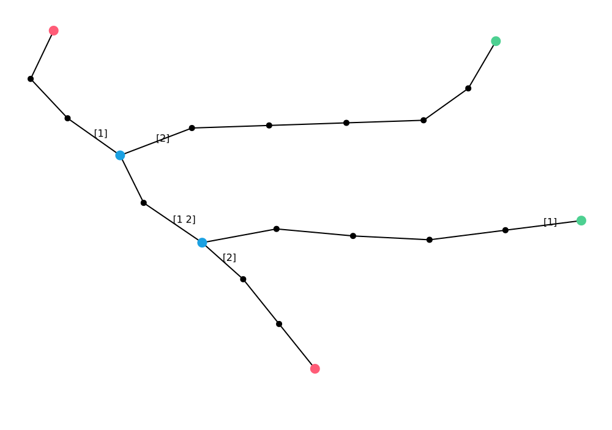
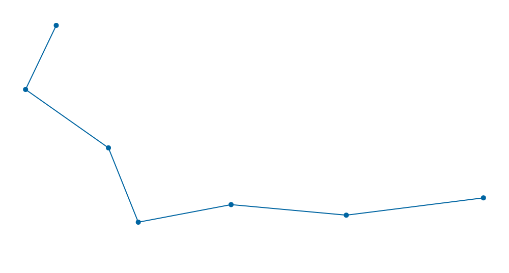
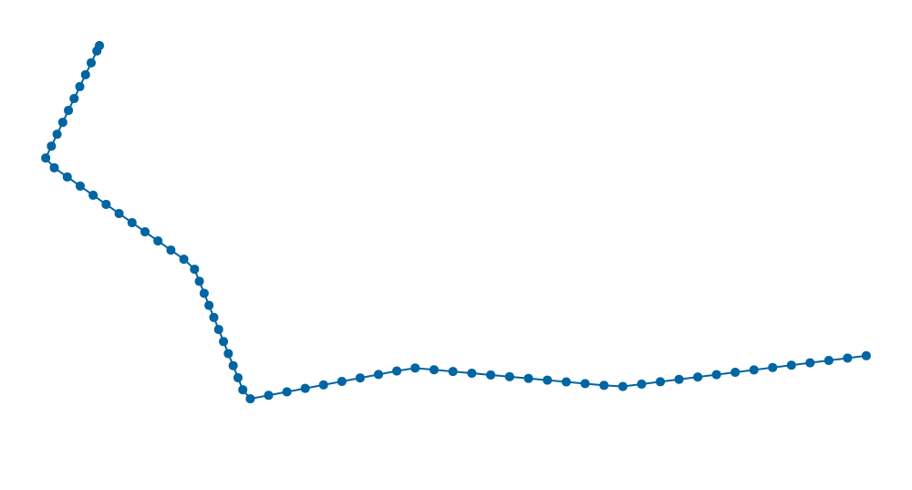
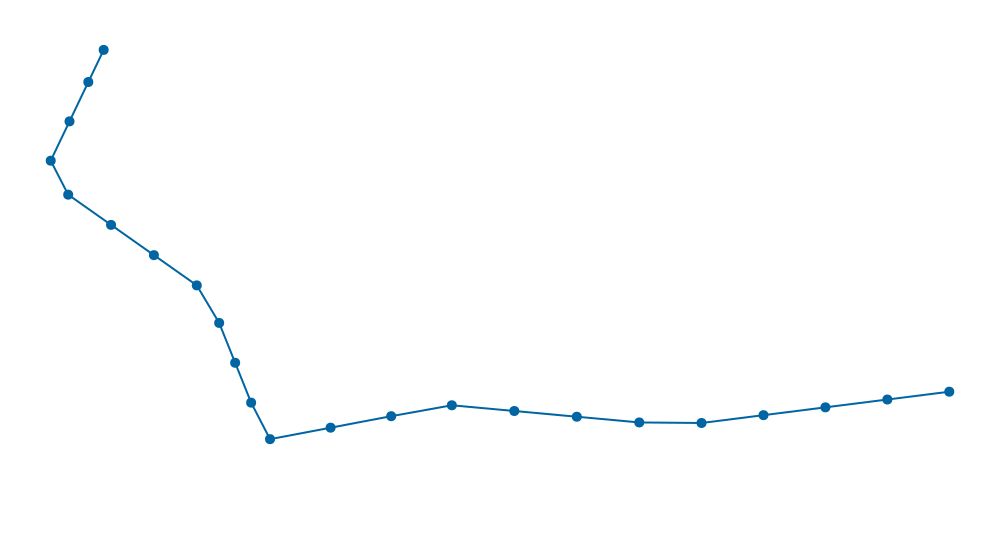
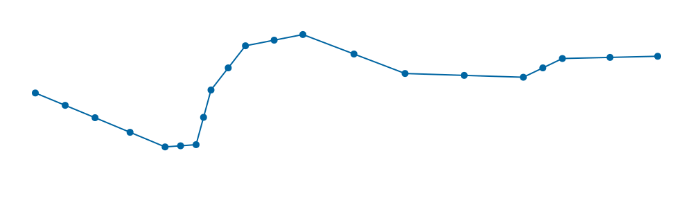

# GeoNet

GeoNet is a library for generating net from multiple gps tracks.

[](https://github.com/mnezerka/geonet/actions/workflows/go.yml)


## Overview

Demostration on set of four GPS tracks located int the same area:



All tracks processed nad merged into one network (numbers attached to each
segment denote which tracks where merged):


Overview of the processing flow:


## Usage

Generate geonet from gpx files in `data` directory. Save net in data.geonet
```bash
geonet gen data/*gpx --interpolate --simplify --save > data.geonet
```

Load net from file and generate html page:
```bash
geonet load data.geonet --export > data.json
```

### Matching

Algorithm for building the network:
- for each track
  - for each point of track
    - look for existing point which is nearby
    - if such point exists, reuse it, else register as new point
    - create edge for each newly registered point

Use `--match-max-dist meters` flag to configure matching algoritm. Setting
distance in meters affects searching of existing points which are nearby.

* the bigger the value -> less points in net, but details are lost
* the smaller the value -> more points in net, more details, but tracks are not merged properly

Source tracks:


Matching distance 1 meter:

```bash
./geonet gen files --match-max-dist 1
```



Matching distance 5 meters:

```bash
./geonet gen files --match-max-dist 5
```


Matching distance 10 meters:

```bash
./geonet gen files --match-max-dist 10
```


Matching distance 50 meters:

```bash
./geonet gen files --match-max-dist 50
```




### Interpolation

Interpolation is an optional preprocessing step that adjusts track points before the track is integrated into the network.

```bash
geonet gen files --interpolate --int-dist 10
```

Source track:



Track after interpolation to 10 meters:

```bash
geonet gen files --interpolate --int-dist 10
```



Track after interpolation to 30 meters:

```bash
geonet gen files --interpolate --int-dist 30
```



### Simplify

Simplification analyzes the track and removes unnecessary points based on the
selected accuracy in meters, using the Douglas-Peucker algorithm. Use flag
`--simplify` to enable simplification. Use flag `--sim-min-dist number` to
set the accuracy in meters.

Note: be aware that matching is mandatory part of network building and affects distancies
between points. Use `--match-max-dist 1` to avoid impac of matching algorithm to minimum.

Source track:



Track after simplification to 10 meters:

```bash
geonet gen files --match-max-dist 1 --simplify --sim-min-dist 10
```


Track after simplification to 50 meters:

```bash
geonet gen files --match-max-dist 1 --simplify --sim-min-dist 50
```


